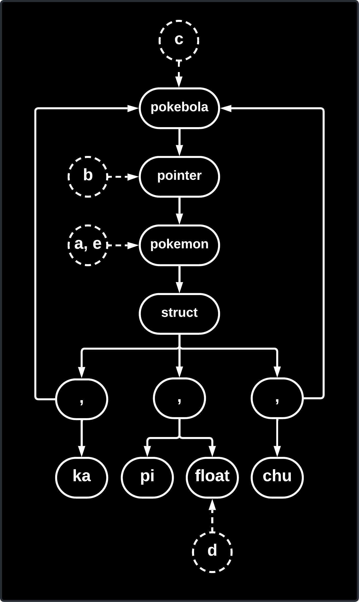
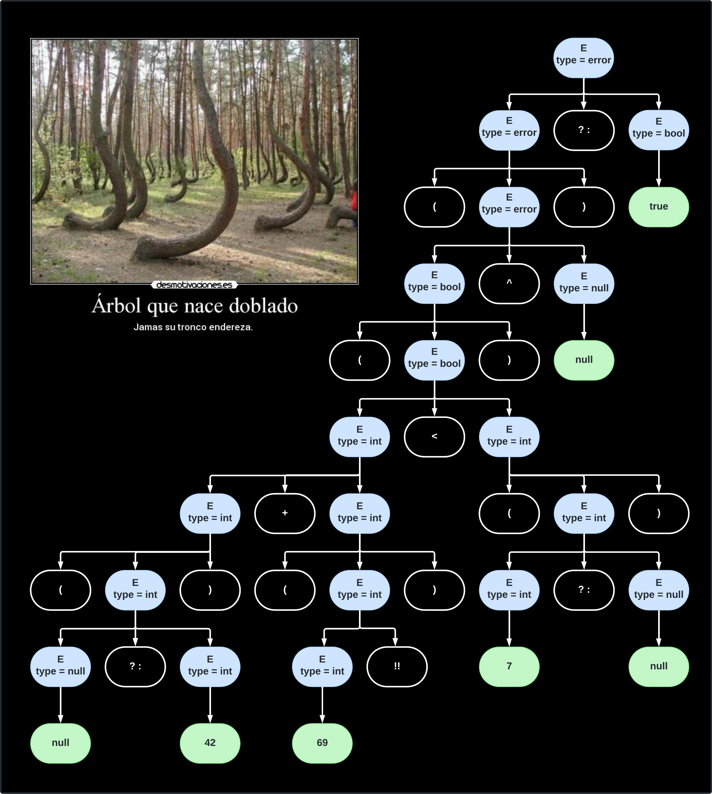

# Resolución de Tarea 3 - Verificación de Tipos (Fecha: 19-03-2025)

$$
\begin{matrix}
\text{Universidad Simón Bolívar} \\
\text{Departamento de Computación y Tecnología de la Información} \\
\text{CI4721 - Lenguajes de Programación II} \\
\text{Enero - Marzo 2025} \\
\text{Estudiante: Junior Miguel Lara Torres (17-10303)} \\
\text{ } \\
\Large \text{Tarea 3 (10 puntos)} \\
\end{matrix}
$$

>[!IMPORTANT]
> Para una correcta visualización de la tarea es recomendable clonar el repositorio y usar una extensión que admita Markdown + Latex complejo (Ej. [Markdown All in One](https://marketplace.visualstudio.com/items?itemName=yzhang.markdown-all-in-one)), dado que durante la resolución de la tarea se usa latex que el motor Markdown de Github no soporta.

# Indice
- [Resolución de Tarea 3 - Verificación de Tipos (Fecha: 19-03-2025)](#resolución-de-tarea-3---verificación-de-tipos-fecha-19-03-2025)
- [Indice](#indice)
- [Pregunta 1](#pregunta-1)
	- [Parte (1.a)](#parte-1a)
	- [Parte (1.b)](#parte-1b)
- [Pregunta 2](#pregunta-2)
	- [Paso 1: `cmap(f, x)`](#paso-1-cmapf-x)
	- [Paso 2: `null(x)`](#paso-2-nullx)
	- [Paso 3: `[]`](#paso-3-)
	- [Paso 4: `f(head(x))`](#paso-4-fheadx)
	- [Paso 5: `cmap(f, tail(x))`](#paso-5-cmapf-tailx)
	- [Paso 6: `concat(cmap(f, tail(x)))`](#paso-6-concatcmapf-tailx)
	- [Paso 7: `if(null(x), [], concat(f(head(x)), cmap(f, tail(x)`](#paso-7-ifnullx--concatfheadx-cmapf-tailx)
	- [Paso 8: `match(cmap(f, x), if(null(x), [], concat(f(head(x)), cmap(f, tail(x)))))`](#paso-8-matchcmapf-x-ifnullx--concatfheadx-cmapf-tailx)
- [Pregunta 3](#pregunta-3)
	- [Parte (3.a)](#parte-3a)
	- [Parte (3.b)](#parte-3b)
	- [Parte (3.c)](#parte-3c)
	- [Parte (3.d)](#parte-3d)

# Pregunta 1
Dada las siguientes declaraciones de tipos

```Crystal
type pokemon = struct
	pi : float
	ka : pokebola
	chu : pokebola
end
```

```Crystal
type pokebola = *pokemon
```

## Parte (1.a)
El grafo de tipos asociado queda como


## Parte (1.b)
Dado el siguiente conjunto de declaraciones
```go
var a : pokemon
var b = &a : Tb 
var c = (*b).chu : Tc 
var d = (*a.chu).pi
var e = *(*(*c).ka).chu
```

* `a` se puede ver directo como tipo `pokemon`.

* `b` recibe la dirección de memoria de `a`. Como `a` es de tipo `pokemon`, `b` resulta ser de tipo `*pokemon` (un puntero a pokemon).

* `c` se asigna con `(*b).chu`. Como `b` apunta a un `struct pokemon`, al acceder a `.chu` se obtiene un elemento de tipo `pokebola`. Por lo tanto, `c` es de tipo `pokebola`.

* `d` se asigna con `(*a.chu).pi`. Aquí, `a.chu` es de tipo `pokebola` (un alias para `*pokemon`), y al desreferenciarlo `(*a.chu)` se accede a un `struct pokemon`. Luego, `.pi` accede a un elemento de tipo `float`, por lo que `d` es de tipo `float`.
  
* `e` se asigna con `*(*(*c).ka).chu`. Primero, `c` (de tipo `pokebola`) se desreferencia para acceder a un `struct pokemon`. Luego, se accede a `ka` (de tipo `pokebola`), se desreferencia nuevamente y se accede a `chu`, que también es de tipo `pokebola`. Finalmente, al desreferenciar `chu`, se obtiene un `struct pokemon`, por lo que `e` es de tipo `pokemon`.

Finalmente, a nivel de grafo tenemos


# Pregunta 2

Dado los siguiente símbolos con su tipos (potencialmente polimórficos):
$$
\begin{array}{rcl}
\text{cmap} & : & \beta \\
\text{f}  & : & \gamma \\
\text{x}  & : & \rho \\
\text{[]}  & : & \forall \alpha.list(\alpha) \\
\text{null} & : & \forall \alpha.list(\alpha) \to bool \\
\text{head} & : & \forall \alpha.list(\alpha) \to \alpha \\
\text{tail} & : & \forall \alpha.list(\alpha) \to list(\alpha) \\
\text{if} & : & \forall \alpha.bool \times \alpha \times \alpha \to list(\alpha) \\
\text{concat} & : & \forall \alpha.list(\alpha) \to list(\alpha) \to list(\alpha) \\
\text{match} & : & \forall \alpha.\alpha \times \alpha \to \alpha \\
\end{array}
$$

Considere también la siguiente expresión:

$$\text{match(cmap(f, x), if(null(x), [], concat(f(head(x)), cmap(f, tail(x)))))}$$

Se desglosa por pasos la frase
* Paso 1: `cmap(f, x)`
* Paso 2: `null(x)`
* Paso 3: `[]`
* Paso 4: `f(head(x))`
* Paso 5: `cmap(f, tail(x))`
* Paso 6: `concat(cmap(f, tail(x)))`
* Paso 7: `if(null(x), [], concat(f(head(x)), cmap(f, tail(x)`
* Paso 8: `match(cmap(f, x), if(null(x), [], concat(f(head(x)), cmap(f, tail(x)))))`

Segun el esquema de verificación tenemos que

## Paso 1: `cmap(f, x)`
|  # | Expresion | Tipo | Sustitución |
|---:|:----------|:-----|:------------|
|  0 | f | $\gamma$ |  |
|  1 | x | $\rho$ |  |
|  2 | cmap | $\beta$ |  |
|  3 | cmap(f, x) | $T_{0}$ | $\beta = \gamma \times \rho \to T_{0}$ |

>[!NOTE]
> * En linea 3: Decimos que `cmap(f, x)` es de tipo $T_0$ que luego será determinado.

## Paso 2: `null(x)`
|  # | Expresion | Tipo | Sustitución |
|---:|:----------|:-----|:------------|
|  0 | f | $\gamma$ |  |
|  1 | x | $\rho$ |  |
|  2 | cmap | $\beta$ |  |
|  3 | cmap(f, x) | $T_{0}$ | $\beta = \gamma \times \rho \to T_{0}$ |
|  4 | x | $\rho$ |  |
|  5 | null | $list(\alpha_5) \to bool$ | |
|  6 | null(x) | bool | $\rho=list(\alpha_5)$ |

>[!NOTE]
> * En linea 6: Dado que `null` recibe una $list(\alpha_5)$ en su argumento implica que el tipo de `x` debe ser $list(\alpha_5)$.

## Paso 3: `[]`
|  # | Expresion | Tipo | Sustitución |
|---:|:----------|:-----|:------------|
|  0 | f | $\gamma$ |  |
|  1 | x | $\rho$ |  |
|  2 | cmap | $\beta$ |  |
|  3 | cmap(f, x) | $T_{0}$ | $\beta = \gamma \times \rho \to T_{0}$ |
|  4 | x | $\rho$ |  |
|  5 | null | $list(\alpha_5) \to bool$ | |
|  6 | null(x) | bool | $\rho=list(\alpha_5)$ |
|  7 | [] | $list(\alpha_7)$ |  |

## Paso 4: `f(head(x))`
|  # | Expresion | Tipo | Sustitución |
|---:|:----------|:-----|:------------|
|  0 | f | $\gamma$ |  |
|  1 | x | $\rho$ |  |
|  2 | cmap | $\beta$ |  |
|  3 | cmap(f, x) | $T_{0}$ | $\beta = \gamma \times \rho \to T_{0}$ |
|  4 | x | $\rho$ |  |
|  5 | null | $list(\alpha_5) \to bool$ | |
|  6 | null(x) | bool | $\rho=list(\alpha_5)$ |
|  7 | [] | $list(\alpha_7)$ |  |
|  8 | x | $list(\alpha_5)$ |  |
|  9 | head | $list(\alpha_9)\to \alpha_9$ |  |
| 10 | head(x) | $\alpha_5$ | $\alpha_5=\alpha_9$ |
| 11 | f | $\gamma$ |  |
| 12 | f(head(x)) | $T_{1}$ | $\gamma=\alpha_5 \to T_{1}$ |

>[!NOTE]
> * En linea 10: Dado que `head` recibe una $list(\alpha_9)$ en su argumento implica que los elementos de `x` deben ser de tipo $\alpha_9$.
> * En linea 12: Apoyándose en linea 10, como f esta recibiendo en su argumento `head(x)` que es de tipo $\alpha_5$ se puede inferir que el tipo de `f` es $\alpha_5 \to T_{1}$.

## Paso 5: `cmap(f, tail(x))`
|  # | Expresion | Tipo | Sustitución |
|---:|:----------|:-----|:------------|
|  0 | f | $\gamma$ |  |
|  1 | x | $\rho$ |  |
|  2 | cmap | $\beta$ |  |
|  3 | cmap(f, x) | $T_{0}$ | $\beta = \gamma \times \rho \to T_{0}$ |
|  4 | x | $\rho$ |  |
|  5 | null | $list(\alpha_5) \to bool$ | |
|  6 | null(x) | bool | $\rho=list(\alpha_5)$ |
|  7 | [] | $list(\alpha_7)$ |  |
|  8 | x | $list(\alpha_5)$ |  |
|  9 | head | $list(\alpha_9)\to \alpha_9$ |  |
| 10 | head(x) | $\alpha_5$ | $\alpha_5=\alpha_9$ |
| 11 | f | $\gamma$ |  |
| 12 | f(head(x)) | $T_{1}$ | $\gamma=\alpha_5 \to T_{1}$ |
| 13 | f | $\alpha_5 \to T_{1}$ |  |
| 14 | x  | $list(\alpha_5)$ |  |
| 15 | tail | $list(\alpha_{15}) \to list(\alpha_{15})$ |  |
| 16 | tail(x) | $list(\alpha_{5})$ | $\alpha_5=\alpha_{15}$ |
| 17 | cmap | $(\alpha_5 \to T_{1}) \times list(\alpha_5) \to T_0$ |
| 18 | cmap(f, tail(x)) | $T_{0}$ |

>[!NOTE]
> * En linea 16: Dado que `tail` recibe una $list(\alpha_{15})$ en su argumento implica que los elementos de `x` deben ser de tipo $\alpha_{15}$.
> * En linea 17: Ya se conoce el tipo de `f` solo a nivel de argumento de entrada, de `tail(x)`, pero aun no sabemos el tipo de `cmap`, que queda como $T_0$.

## Paso 6: `concat(cmap(f, tail(x)))`
|  # | Expresion | Tipo | Sustitución |
|---:|:----------|:-----|:------------|
|  0 | f | $\gamma$ |  |
|  1 | x | $\rho$ |  |
|  2 | cmap | $\beta$ |  |
|  3 | cmap(f, x) | $T_{0}$ | $\beta = \gamma \times \rho \to T_{0}$ |
|  4 | x | $\rho$ |  |
|  5 | null | $list(\alpha_5) \to bool$ | |
|  6 | null(x) | bool | $\rho=list(\alpha_5)$ |
|  7 | [] | $list(\alpha_7)$ |  |
|  8 | x | $list(\alpha_5)$ |  |
|  9 | head | $list(\alpha_9)\to \alpha_9$ |  |
| 10 | head(x) | $\alpha_5$ | $\alpha_5=\alpha_9$ |
| 11 | f | $\gamma$ |  |
| 12 | f(head(x)) | $T_{1}$ | $\gamma=\alpha_5 \to T_{1}$ |
| 13 | f | $\alpha_5 \to T_{1}$ |  |
| 14 | x  | $list(\alpha_5)$ |  |
| 15 | tail | $list(\alpha_{15}) \to list(\alpha_{15})$ |  |
| 16 | tail(x) | $list(\alpha_{5})$ | $\alpha_5=\alpha_{15}$ |
| 17 | cmap | $(\alpha_5 \to T_{1}) \times list(\alpha_5) \to T_0$ |
| 18 | cmap(f, tail(x)) | $T_{0}$ |
| 19 | concat | $list(\alpha_{19})\times list(\alpha_{19}) \to list(\alpha_{19})$ |  |
| 20 | concat(f(head(x)), cmap(f, tail(x))) | $list(\alpha_{19})$ | $T_0 = T_1 = list(\alpha_{19})$ |

>[!NOTE]
> * En linea 20: Dado que `concat` recibe un par de argumentos de tipo $list(\alpha_{19})$ implica que los valores de retorno de `f` y `cmap` deben ser de tipo $list(\alpha_{19})$.

## Paso 7: `if(null(x), [], concat(f(head(x)), cmap(f, tail(x)`
|  # | Expresion | Tipo | Sustitución |
|---:|:----------|:-----|:------------|
|  0 | f | $\gamma$ |  |
|  1 | x | $\rho$ |  |
|  2 | cmap | $\beta$ |  |
|  3 | cmap(f, x) | $T_{0}$ | $\beta = \gamma \times \rho \to T_{0}$ |
|  4 | x | $\rho$ |  |
|  5 | null | $list(\alpha_5) \to bool$ | |
|  6 | null(x) | bool | $\rho=list(\alpha_5)$ |
|  7 | [] | $list(\alpha_7)$ |  |
|  8 | x | $list(\alpha_5)$ |  |
|  9 | head | $list(\alpha_9)\to \alpha_9$ |  |
| 10 | head(x) | $\alpha_5$ | $\alpha_5=\alpha_9$ |
| 11 | f | $\gamma$ |  |
| 12 | f(head(x)) | $T_{1}$ | $\gamma=\alpha_5 \to T_{1}$ |
| 13 | f | $\alpha_5 \to T_{1}$ |  |
| 14 | x  | $list(\alpha_5)$ |  |
| 15 | tail | $list(\alpha_{15}) \to list(\alpha_{15})$ |  |
| 16 | tail(x) | $list(\alpha_{5})$ | $\alpha_5=\alpha_{15}$ |
| 17 | cmap | $(\alpha_5 \to T_{1}) \times list(\alpha_5) \to T_0$ |
| 18 | cmap(f, tail(x)) | $T_{0}$ |
| 19 | concat | $list(\alpha_{19})\times list(\alpha_{19}) \to list(\alpha_{19})$ |  |
| 20 | concat(f(head(x)), cmap(f, tail(x))) | $list(\alpha_{19})$ | $T_0 = T_1 = list(\alpha_{19})$ || 21 | if | $bool \times \alpha_{21} \times \alpha_{21} \to \alpha_{21}$ |  |
| 22 | if | $bool \times \alpha_{22} \times \alpha_{22} \to \alpha_{22}$ |
| 23 | if(null(x), [], concat(f(head(x)), cmap(f, tail(x)))) | $list(\alpha_7)$ | $\begin{array}{ll} \alpha_{22} = list(\alpha_7) \\ \alpha_{19} = \alpha_7 \end{array}$ |

>[!NOTE]
> * En linea 23: Dado que `if` recibe una tripleta de argumentos, donde el primer parametro indica el valor de la guardia, el segundo indica el caso de guardia verdadera y el tercero el caso contrario. Entonces, si `null(x)` es `true`, el valor de retorno es `[]` por lo que el tipo del segundo argumento debe ser $list(\alpha_7)$. Si `null(x)` es `false`, el valor de retorno es `concat(f(head(x)), cmap(f, tail(x)))` por lo que el tipo del tercer argumento debe ser $\alpha_{19}$, sin embargo como el `if` obliga que la salida sea igual implica $\alpha_{19} = \alpha_{7}$.

## Paso 8: `match(cmap(f, x), if(null(x), [], concat(f(head(x)), cmap(f, tail(x)))))`
|  # | Expresion | Tipo | Sustitución |
|---:|:----------|:-----|:------------|
|  0 | f | $\gamma$ |  |
|  1 | x | $\rho$ |  |
|  2 | cmap | $\beta$ |  |
|  3 | cmap(f, x) | $T_{0}$ | $\beta = \gamma \times \rho \to T_{0}$ |
|  4 | x | $\rho$ |  |
|  5 | null | $list(\alpha_5) \to bool$ | |
|  6 | null(x) | bool | $\rho=list(\alpha_5)$ |
|  7 | [] | $list(\alpha_7)$ |  |
|  8 | x | $list(\alpha_5)$ |  |
|  9 | head | $list(\alpha_9)\to \alpha_9$ |  |
| 10 | head(x) | $\alpha_5$ | $\alpha_5=\alpha_9$ |
| 11 | f | $\gamma$ |  |
| 12 | f(head(x)) | $T_{1}$ | $\gamma=\alpha_5 \to T_{1}$ |
| 13 | f | $\alpha_5 \to T_{1}$ |  |
| 14 | x  | $list(\alpha_5)$ |  |
| 15 | tail | $list(\alpha_{15}) \to list(\alpha_{15})$ |  |
| 16 | tail(x) | $list(\alpha_{5})$ | $\alpha_5=\alpha_{15}$ |
| 17 | cmap | $(\alpha_5 \to T_{1}) \times list(\alpha_5) \to T_0$ |
| 18 | cmap(f, tail(x)) | $T_{0}$ |
| 19 | concat | $list(\alpha_{19})\times list(\alpha_{19}) \to list(\alpha_{19})$ |  |
| 20 | concat(f(head(x)), cmap(f, tail(x))) | $list(\alpha_{19})$ | $T_0 = T_1 = list(\alpha_{19})$ || 21 | if | $bool \times \alpha_{21} \times \alpha_{21} \to \alpha_{21}$ |  |
| 22 | if | $bool \times \alpha_{22} \times \alpha_{22} \to \alpha_{22}$ |
| 23 | if(null(x), [], concat(f(head(x)), cmap(f, tail(x)))) | $list(\alpha_7)$ | $\begin{array}{ll} \alpha_{22} = list(\alpha_7) \\ \alpha_{19} = \alpha_7 \end{array}$ |
| 24 | match | $\alpha_{24} \times \alpha_{24} \to \alpha_{24}$ |  |
| 25 | match(cmap(f, x), if(null(x), [], concat(f(head(x)), cmap(f, tail(x))))) | $list(\alpha_7)$ | $\alpha_{24} = list(\alpha_7)$ |

>[!NOTE]
> * En linea 25: Dado que `match` recibe una tupla de argumentos, donde el primero es un `cmap(...)` que por linea 20 se habla del tipo $list(\alpha_{19})$ y a nivel del segundo argumento se habla de un `if` que de tipo $list(\alpha_{7})$ por linea 23. Y ademas, sabemos que $\alpha_{19} = \alpha_{7}$ por linea 23, quiere decir entonces que tanto el `cmap` como el `i`f retornan el mismo tipo lo que implica que $\alpha_{24}$ sea del mismo tipo.

Finalmente, para `cmap` se tiene 
$$cmap : \forall \alpha_5, \alpha_7.((\alpha_5 \to list(\alpha_7))\times list(\alpha_5) \to list(\alpha_7))$$

# Pregunta 3

Considere la siguiente gramática de expresiones:

$$
\begin{array}{rcl}
E &  \to & E+E \\
  &   |  & E \land E \\
  &   |  & E < E \\
  &   |  & E~?: E \\
  &   |  & E !! \\
  &   |  & (E) \\
  &   |  & num \\
  &   |  & true \\
  &   |  & false \\
  &   |  & null \\
\end{array}
$$

## Parte (3.a)

La construcción de las reglas asociadas para $type$ es

$$
\begin{array}{rcl}
E_0 &  \to & E_1 + E_2 ~\{\\
    &      & ~~~~~~~~E_0.type \leftarrow E_1.type \neq INT \vee E_2.type \neq INT~~?~~ type\_error : INT \\
    &      & \} \\
    &   |  & E_1 \land E_2 ~\{\\
	&      & ~~~~~~~~E_0.type  \leftarrow E_1.type \neq BOOL \vee E_2.type \neq BOOL~~?~~ type\_error : BOOL \\
    &      & \}\\
    &   |  & E_1 < E_2 ~\{\\
    &      & ~~~~~~~~E_0.type  \leftarrow E_1.type \neq INT \vee E_2.type \neq INT~~?~~ type\_error : BOOL \\
    &      & \}\\
    &   |  & E_1~?: E_2 ~\{\\
	&      & ~~~~~~~~E_0.type \leftarrow E_1.type \neq NULL~~?~~E_1.type : E_2.type \\
    &      & \}\\
    &   |  & E_1 !! ~\{\\
	&      & ~~~~~~~~E_0.type \leftarrow E_1.type \neq NULL~~?~~E_1.type : type\_error \\
    &      & \}\\
    &   |  & (E) ~~~~~\{~E_0.type \leftarrow E_1.type~\}\\
    &   |  & num ~~~\{~E_0.type \leftarrow INT~\}\\
	&   |  & true ~~~\{~E_0.type \leftarrow BOOL~\}\\
    &   |  & false ~\{~E_0.type \leftarrow BOOL~\}\\
    &   |  & null ~~~\{~E_0.type \leftarrow NULL~\}\\
\end{array}
$$

## Parte (3.b)

Dada la siguiente frase

$$(((null ?: 42) + (69 !!) < (7 ? : null)) \land null)~?: true$$

Determinemos el `type` de la misma:



## Parte (3.c)

Considere la gramática de instrucciones vista en clase y auméntela con una producción de la forma:

$$S \to repeatWhen~~E~~lt~~S~~gt~~S$$

La construcción de la regla queda tal que

$$
\begin{array}{rcl}
S_0 &  \to & repeatWhen~~E~~lt~~S_1~~gt~~S_2 ~\{\\
    &      & ~~~~~~~~ if~~E.type \neq INT~~then~~S_0.type \leftarrow type\_error \\
	&      & ~~~~~~~~ if~~E.val < 0~~then~~S_0.type \leftarrow S_1.type\\
	&      & ~~~~~~~~ else~if~~E.val > 0~~then~~S_0.type \leftarrow S_2.type\\
	&      & ~~~~~~~~ else~~S_0.type \leftarrow void\\
    &      & \} \\
\end{array}
$$

## Parte (3.d)

Para cada producción se tienen las siguientes reglas

* $E \to E+E$
$$
\displaystyle\frac{\rho \vdash e_1 : int ~~~~~~~~ \rho \vdash e_2 : int}{\rho \vdash e_1 + e_2 : int}
$$

* $E \to E \land E$
$$
\displaystyle\frac{\rho \vdash e_1 : bool ~~~~~~~~ \rho \vdash e_2 : bool}{\rho \vdash e_1 \land e_2 : bool}
$$

* $E \to E<E$
$$
\displaystyle\frac{\rho \vdash e_1 : int ~~~~~~~~ \rho \vdash e_2 : int}{\rho \vdash e_1 < e_2 : bool}
$$

* $E \to E~?:E$
$$
\begin{matrix}
\displaystyle\frac{\rho \vdash e_1 : \varphi ~~~~~~~~ \rho \vdash e_2 : \omega ~~~~~~~~ \varphi \neq null}{\rho \vdash e_1~ ?: e_2 : \varphi } & \displaystyle\frac{\rho \vdash e_1 : null ~~~~~~~~ \rho \vdash e_2 : \omega}{\rho \vdash e_1~?: e_2 : \omega } \\
\end{matrix}
$$

* $E \to E!!$
$$
\displaystyle\frac{\rho \vdash e : \varphi ~~~~~~~~ \varphi \neq null}{\rho \vdash e !! : \varphi}
$$

* $S \to repeatWhen~~E~~lt~~S~~gt~~S$
$$
\begin{matrix}
\displaystyle\frac{\rho \vdash e : int ~~~~~~~~ e < 0 ~~~~~~~~ \rho \vdash s_1 : \varphi ~~~~~~~~ \rho \vdash s_2 : \omega}{\rho \vdash repeatWhen~~e~~lt~~s_1~~gt~~s_2:\varphi} \\ \\
\displaystyle\frac{\rho \vdash e : int ~~~~~~~~ e > 0 ~~~~~~~~ \rho \vdash s_1 : \varphi ~~~~~~~~ \rho \vdash s_2 : \omega}{\rho \vdash repeatWhen~~e~~lt~~s_1~~gt~~s_2:\omega} \\ \\
\displaystyle\frac{\rho \vdash e : int ~~~~~~~~ e = 0 ~~~~~~~~ \rho \vdash s_1 : \varphi ~~~~~~~~ \rho \vdash s_2 : \omega}{\rho \vdash repeatWhen~~e~~lt~~s_1~~gt~~s_2:void} \\
\end{matrix}
$$

