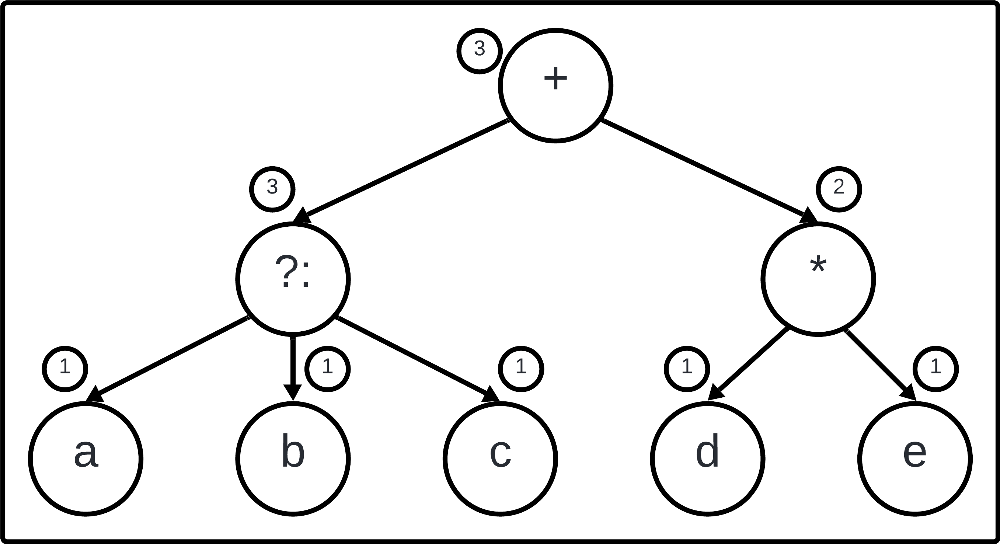

# Resolución de Tarea 1 - Generación de Código (Fecha: 01-06-2025)

$$
\begin{matrix}
\text{Universidad Simón Bolívar} \\
\text{Departamento de Computación y Tecnología de la Información} \\
\text{CI4721 - Lenguajes de Programación II} \\
\text{Abril - Julio 2025} \\
\text{Estudiante: Junior Miguel Lara Torres (17-10303)} \\
\text{ } \\
\Large \text{Tarea 1 (10 puntos)} \\
\end{matrix}
$$

>[!IMPORTANT]
> Para una correcta visualización de la tarea es recomendable clonar el repositorio y usar una extensión que admita Markdown + Latex complejo (Ej. [Markdown All in One](https://marketplace.visualstudio.com/items?itemName=yzhang.markdown-all-in-one)), dado que durante la resolución de la tarea se usa latex que el motor Markdown de Github no soporta.

# Indice
- [Resolución de Tarea 1 - Generación de Código (Fecha: 01-06-2025)](#resolución-de-tarea-1---generación-de-código-fecha-01-06-2025)
- [Indice](#indice)
	- [Pregunta 1](#pregunta-1)
	- [Pregunta 2](#pregunta-2)
		- [Parte (2.a)](#parte-2a)
		- [Parte (2.b)](#parte-2b)
		- [Parte (2.c)](#parte-2c)
		- [Parte (2.d)](#parte-2d)
	- [Pregunta 3](#pregunta-3)
		- [Parte (3.a)](#parte-3a)
		- [Parte (3.b)](#parte-3b)
	- [Pregunta 4](#pregunta-4)
		- [Parte (4.a)](#parte-4a)
		- [Parte (4.b)](#parte-4b)
		- [Parte (4.c)](#parte-4c)
		- [Parte (4.d)](#parte-4d)

## Pregunta 1

Se tiene en parte inicial el siguiente conjunto de variables vivas inicial, instrucciones escrito en TAC y se quiere calcular el conjunto de variables vivas y la información de uso futuro antes y después de cada una de éstas.

| Instrucción | Variables Vivas | Uso Futuro |
|:-----------:|:---------------:|:----------:|
| a := b + c  |                 |            |
| b := a / 2  |                 |            |
| b := d - c  |                 |            |
| a := a + d  |                 |            |
| c := b * a  | $\{b, d\}$      | $\text{nextuse(a) = undef} \\ \text{nextuse(b) = undef} \\ \text{nextuse(c) = undef} \\ \text{nextuse(d) = undef}$ |

* Analizando la Instrucción `c := b * a` tenemos que estan vivas `b` y `a` con uso futuro en el bloque 5.

| Instrucción | Variables Vivas | Uso Futuro |
|:-----------:|:---------------:|:----------:|
| a := b + c  |                 |            |
| b := a / 2  |                 |            |
| b := d - c  |                 |            |
| a := a + d  | $\{a, b, d\}$   | $\text{nextuse(a) = 5} \\ \text{nextuse(b) = 5} \\ \text{nextuse(c) = undef} \\ \text{nextuse(d) = undef}$ |
| c := b * a  | $\{b, d\}$      | $\text{nextuse(a) = undef} \\ \text{nextuse(b) = undef} \\ \text{nextuse(c) = undef} \\ \text{nextuse(d) = undef}$ |

* Analizando la Instrucción `a := a + d` tenemos que se conservan las variables vivas (`a`, `b`, `c`) pero hay un cambio en el uso furuto de `a` y `d` en el bloque 4.

| Instrucción | Variables Vivas | Uso Futuro |
|:-----------:|:---------------:|:----------:|
| a := b + c  |                 |            |
| b := a / 2  |                 |            |
| b := d - c  | $\{a, b, d\}$   | $\text{nextuse(a) = 4} \\ \text{nextuse(b) = 5} \\ \text{nextuse(c) = undef} \\ \text{nextuse(d) = 4}$ |
| a := a + d  | $\{a, b, d\}$   | $\text{nextuse(a) = 5} \\ \text{nextuse(b) = 5} \\ \text{nextuse(c) = undef} \\ \text{nextuse(d) = undef}$ |
| c := b * a  | $\{b, d\}$      | $\text{nextuse(a) = undef} \\ \text{nextuse(b) = undef} \\ \text{nextuse(c) = undef} \\ \text{nextuse(d) = undef}$ |

* Analizando la Instrucción `b := a / 2` tenemos que estan vivas `a`, `c` y `d` con uso futuro de 4 para `a` y 3 para `c` y `d`.

| Instrucción | Variables Vivas | Uso Futuro |
|:-----------:|:---------------:|:----------:|
| a := b + c  |                 |            |
| b := a / 2  | $\{a, c, d\}$   | $\text{nextuse(a) = 4} \\ \text{nextuse(b) = undef} \\ \text{nextuse(c) = 3} \\ \text{nextuse(d) = 3}$ |
| b := d - c  | $\{a, b, d\}$   | $\text{nextuse(a) = 4} \\ \text{nextuse(b) = 5} \\ \text{nextuse(c) = undef} \\ \text{nextuse(d) = 4}$ |
| a := a + d  | $\{a, b, d\}$   | $\text{nextuse(a) = 5} \\ \text{nextuse(b) = 5} \\ \text{nextuse(c) = undef} \\ \text{nextuse(d) = undef}$ |
| c := b * a  | $\{b, d\}$      | $\text{nextuse(a) = undef} \\ \text{nextuse(b) = undef} \\ \text{nextuse(c) = undef} \\ \text{nextuse(d) = undef}$ |

* Analizando la Instrucción `a := b + c` tenemos que se conservan las variables vivas (`a`, `b`, `c`) pero hay un cambio en el uso futuro de 2 para `a` y 3 para `c` y `d`.

| Instrucción | Variables Vivas | Uso Futuro |
|:-----------:|:---------------:|:----------:|
| a := b + c  | $\{a, c, d\}$   | $\text{nextuse(a) = 2} \\ \text{nextuse(b) = undef} \\ \text{nextuse(c) = 3} \\ \text{nextuse(d) = 3}$ |
| b := a / 2  | $\{a, c, d\}$   | $\text{nextuse(a) = 4} \\ \text{nextuse(b) = undef} \\ \text{nextuse(c) = 3} \\ \text{nextuse(d) = 3}$ |
| b := d - c  | $\{a, b, d\}$   | $\text{nextuse(a) = 4} \\ \text{nextuse(b) = 5} \\ \text{nextuse(c) = undef} \\ \text{nextuse(d) = 4}$ |
| a := a + d  | $\{a, b, d\}$   | $\text{nextuse(a) = 5} \\ \text{nextuse(b) = 5} \\ \text{nextuse(c) = undef} \\ \text{nextuse(d) = undef}$ |
| c := b * a  | $\{b, d\}$      | $\text{nextuse(a) = undef} \\ \text{nextuse(b) = undef} \\ \text{nextuse(c) = undef} \\ \text{nextuse(d) = undef}$ |

## Pregunta 2

### Parte (2.a)

Se describe el siguiente funcionamiento de `label(n)`.

* $label(n) \leftarrow max(label(c_{left}), label(c_{middle}, label(c_{right}))$ con la condición $label(c_{left}) \neq label(c_{middle} \neq label(c_{right}$
* $label(n) \leftarrow max(label(c_{left}, label(c_{middle}+1)))$ con la condición $label(c_{left} \neq label(c_{middle} \land label(c_{middle}) = label(c_{right})$
* $label(n) \leftarrow label(c_{left} + 2) $ con la condicion $label(c_{left}) = label(c_{middle}) = label(c_{right})$

### Parte (2.b)

- Si se cumple que $label(c_{left}) \neq label(c_{middle}) \neq label(c_{right})$ y los valores son $k > h > n$:
	- Se genera el código para $c_{left}$ usando la base `b` y el resultado se almacena en $R_{b+k−1}$
	- Se genera el código para $c_{middle}$ con la misma base `b` y se guarda en $R_{b+h−1}$
	- Se genera el código para $c_{right}$ también con base `b` y se almacena en $R_{b+n−1}$

    El código resultante es: $\otimes R_{b+k−1}R_{b+k−1}R_{b+h−1}R_{b+n−1}$

- Si hay al menos dos hijos con la misma etiqueta, suponiendo $k > m$ y que $k$ es diferente:
	- Se genera el código para el nodo $c_{i}$ con etiqueta `k` usando base `b`, guardando el resultado en $R_{b+k-1}$
	- Para los nodos $c_{i}$ y $c_{j}$, se genera código usando las bases `b` y `b+1`, almacenando los resultados en $R_{b+k−2}$ y $R_{b+k−1}$ respectivamente.
  
    El código generado es: $\otimes R_{b+k−1} := \otimes R_{b+k−1}R_{b+k−1}R_{b+k−2}$

- Cuando $label(c_{left}) = label(c_{middle}) = label(c_{right})$, los hijos requerirán $k − 2$ registros:
	- Para $c_{left}$, el código se genera con base `b` y se guarda en $R_{b+k−3}$
	- Para $c_{middle}$, se usa la base `b + 1` y el resultado se almacena en $R_{b+k−2}$
	- Para $c_{right}$, se utiliza la base `b + 2` y se guarda en $R_{b+k−1}$
 
    El código final es: $\otimes R_{b+k−1}R_{b+k−3}R_{b+k−2}R_{b+k−1}$

### Parte (2.c)

A continuación se muestra cómo se genera el código FAC a partir del AST dado, donde los números junto a cada nodo indican el valor del label calculado para ese nodo.

El proceso de generación de código es el siguiente:

Comenzando desde la raíz, se toma la base b = 1, por lo que se emplearán los registros R1, R2 y R3. Dado que label(cl) es mayor que label(cr), se inicia el recorrido por el subárbol izquierdo.

- Para el nodo cl, la base es b = 1 y el resultado se almacena en R3. Como sus tres hijos tienen el mismo label, se procede así:
  - El hijo cll utiliza la base b = 1 y su resultado va en R1. Se genera la instrucción: LD R1, a
  - El hijo clm usa la base b = 2 y almacena el resultado en R2. Se genera: LD R2, b
  - El hijo clr toma la base b = 3 y guarda el resultado en R3. Se genera: LD R3, c

Al volver al nodo cl, se emite la instrucción TERN R3, R1, R2, R3, que corresponde a la operación ternaria a ? b : c, dejando el resultado en R3.

- Para el nodo cr, la base es b = 1 y el resultado se guarda en R2:
  - El hijo crl emplea la base b = 1 y almacena el resultado en R1. Se genera: LD R1, d
  - El hijo crr usa la base b = 2 y guarda el resultado en R2. Se genera: LD R2, e

Al regresar al nodo cr, se produce la instrucción MUL R2, R1, R2.

- Finalmente, al retornar a la raíz, se emite la instrucción ADD R3, R2, R3.

Por lo tanto, el código FAC generado es:

$$
\begin{array}{l} 
\text{LD R1, a} \\
\text{LD R2, b} \\
\text{LD R3, c} \\
\text{TERN R3, R1, R2, R3} \\
\text{LD R1, d} \\
\text{LD R2, e} \\
\text{MUL R2, R1, R2} \\
\text{ADD R3, R2, R3} \\
\end{array}
$$

### Parte (2.d)

Que diosito nos acompañe.

## Pregunta 3

Se responden los siguientes apartado teniendo en cuenta la siguiente instrucción

$$\text{we[have] = to[go[deep]] + er}$$

### Parte (3.a)

El código TAC respectivo es

$$\begin{array}{l} 
\text{t1 := deep * 4} \\ 
\text{t2 := go[t1]}   \\ 
\text{t3 := t2 + er}  \\ 
\text{t4 := t3 * 4}   \\ 
\text{t5 := to[t4]}   \\ 
\text{t6 := have * 4} \\ 
\text{we[t6] := t5} 
\end{array}$$

>[!NOTE]
> En un contexto de arreglos de enteros se multiplica por `4` los índices los enteros se representan en 4 bytes.

### Parte (3.b)

Realizacion las iteraciones respectivas e ilustrando a nivel de las siguientes tablas obtenemos que

- [x] Inicial

| R1 | R2 | R3 |$\|$| we | have | to | go | deep | er | t1 | t2 | t3 | t4 | t5 | t6 |
|----|----|----|----|----|------|----|----|------|----|----|----|----|----|----|----|
|    |    |    |$\|$| we | have | to | go | deep | er |    |    |    |    |    |    |

- [x] Iteración 1: $\text{getReg(t1 := deep * 4)}$

Se obtienen los registro `R1`, `R1` y `R2` dado que se carga `deep` en `R1` y `4` en `R2`. Como deep no es usalo a futuro se almacena el valor de la multiplicacion `t1` en `R1`.

| R1 | R2 | R3 |$\|$| we | have | to | go | deep | er | t1 | t2 | t3 | t4 | t5 | t6 |
|----|----|----|----|----|------|----|----|------|----|----|----|----|----|----|----|
| t1 | 4  |    |$\|$| we | have | to | go | deep | er | R1 |    |    |    |    |    |

Código generado: $\begin{array}{l} \text{LD R1, deep} \\ \text{LD R2, 4} \\ \text{MUL R1, R1, R2} \end{array}$

- [x] Iteración 2: $\text{getReg(t2 := go[t1])}$

Se obtienen los registros `R1` y `R3` dado que en R1 está el valor de `t1` y `R3` es un registro vacío.

| R1 | R2 | R3 |$\|$| we | have | to | go | deep | er | t1 | t2 | t3 | t4 | t5 | t6 |
|----|----|----|----|----|------|----|----|------|----|----|----|----|----|----|----|
| t1 | 4  | t2 |$\|$| we | have | to | go | deep | er | R1 | R3 |    |    |    |    |

Código generado: $\begin{array}{l} \text{LD R3, go(R1)} \end{array}$

- [x] Iteración 3: $\text{getReg(t3 := t2 + er)}$

Se obtienen los registro `R1`, `R3` y `R1` dado que en `R3` esta el valor de `t2` y carga `er` en `R1` porque `t1` no se usa luego. Como `er` no es utulizado a futuro se almacena el valor de la suma `t3` en `R1`.

| R1 | R2 | R3 |$\|$| we | have | to | go | deep | er | t1 | t2 | t3 | t4 | t5 | t6 |
|----|----|----|----|----|------|----|----|------|----|----|----|----|----|----|----|
| t3 | 4  | t2 |$\|$| we | have | to | go | deep | er |    | R3 | R1 |    |    |    |

Código generado: $\begin{array}{l} \text{LD R1, er} \\ \text{ADD R1, R3, R1} \end{array}$

- [x] Iteración 4: $\text{getReg(t4 := t3 * 4)}$

Se obtienen los registro `R1`, `R2` y `R1` dado que en `R2` esta el valor `4` y en `R1` está el valor de `t3`. Como `t3` no es utilizado a futuro se almacena el valor de la multiplicacion `t4` en `R1`.

| R1 | R2 | R3 |$\|$| we | have | to | go | deep | er | t1 | t2 | t3 | t4 | t5 | t6 |
|----|----|----|----|----|------|----|----|------|----|----|----|----|----|----|----|
| t4 | 4  | t2 |$\|$| we | have | to | go | deep | er |    | R3 |    | R1 |    |    |

Código generado: $\begin{array}{l} \text{MUL R1, R1, R2} \end{array}$

- [x] Iteración 5: $\text{getReg(t5 := to[t4])}$

Se obtienen los registros `R1` y `R3` dado que en `R1` está el valor de `t4`. Como `t2` no es utilizado a futuro se almacena el valor de `t5` en `R3`.

| R1 | R2 | R3 |$\|$| we | have | to | go | deep | er | t1 | t2 | t3 | t4 | t5 | t6 |
|----|----|----|----|----|------|----|----|------|----|----|----|----|----|----|----|
| t4 | 4  | t5 |$\|$| we | have | to | go | deep | er |    |    |    | R1 | R3 |    |

Código generado: $\begin{array}{l} \text{LD R3, to(R1)} \end{array}$

- [x] Iteración 6: $\text{getReg(t6 := have * 4)}$

Se obtienen los registro `R1`, `R2` y `R2` dado que en `R2` esta el valor `4` y carga a `R1` la variable `have` dado que `t4` ya no se usará a futuro. Como `4` no es utilizado a futuro se almacena el valor de `t6` en `R2`.

| R1 | R2 | R3 |$\|$| we | have   | to | go | deep | er | t1 | t2 | t3 | t4 | t5 | t6 |
|----|----|----|----|----|--------|----|----|------|----|----|----|----|----|----|----|
|have| t6 | t5 |$\|$| we |have, R1| to | go | deep | er |    |    |    |    | R3 | R2 |

Código generado: $\begin{array}{l} \text{LD R1, have} \\ \text{MUL R2, R1, R2} \end{array}$

- [X] Iteración 7: $\text{getReg(we[t6] := t5)}$

Se obtienen los registros `R2` y `R3` dado que en `R2` esta el valor de `t6` y en `R3` esta el valor de `t5`. 

| R1 | R2 | R3 |$\|$| we | have   | to | go | deep | er | t1 | t2 | t3 | t4 | t5 | t6 |
|----|----|----|----|----|--------|----|----|------|----|----|----|----|----|----|----|
|have| t6 | t5 |$\|$| we |have, R1| to | go | deep | er |    |    |    |    | R3 | R2 |

Código generado: $\begin{array}{l} \text{ST we(R2), R3} \end{array}$

Finalmente obtenemos que 

$$
\begin{array}{l} 
\text{LD R1, deep} \\
\text{LD R2, 4} \\
\text{MUL R1, R1, R2} \\
\text{ } \\
\text{LD R3, go(R1)} \\
\text{ } \\
\text{LD R1, er} \\ 
\text{ADD R1, R3, R1} \\
\text{ } \\
\text{MUL R1, R1, R2} \\
\text{ } \\
\text{LD R3, to(R1)} \\
\text{ } \\
\text{LD R1, have} \\ 
\text{MUL R2, R1, R2} \\
\text{ } \\
\text{ST we(R2), R3}
\end{array}
$$

## Pregunta 4

### Parte (4.a)

Se planteaeel siguiente pseudo-código

$$
\begin{array}{l}
\text{n = number} \\
\text{count = 0} \\
\text{while (n != 1) do} \\
~~~~~~~~\text{if (n\%2 == 2) do} \\
~~~~~~~~~~~~~~~~\text{n = n/2} \\
~~~~~~~~~~~~~~~~\text{count++} \\
~~~~~~~~\text{else do} \\
~~~~~~~~~~~~~~~~\text{n = 3*n + 1} \\
~~~~~~~~~~~~~~~~\text{count++} \\
\text{print(count)} \\
\end{array}
$$

### Parte (4.b)

El TAC asociado es el siguiente

$$
\begin{array}{l}
\text{~ 1 : n := number} \\
\text{~ 2 : count := 0} \\
\text{~ 3 : if n == 1 goto (13)} \\
\text{~ 4 : t1 := n\%2} \\
\text{~ 5 : if t1 != 0 goto (9)} \\
\text{~ 6 : count := count + 1} \\
\text{~ 7 : n := n/2} \\
\text{~ 8 : goto (3)} \\
\text{~ 9 : count := count + 1} \\
\text{10 : t2 := 3*n} \\
\text{11 : n := t2 + 1} \\
\text{12 : goto (3)} \\
\text{13 : print count} \\
\end{array}
$$

### Parte (4.c)

Se tienen que las instrucciones lider son:
* (1): Primera instrucción.
* (3): Destino de goto en (8) y (12).
* (4): Instrucción siguiente a goto.
* (6): Instrucción siguiente a goto.
* (9): Instrucción siguiente a goto.
* (13): Destino de goto en (3).

Asi nos queda el grafo de flujo como sigue

### Parte (4.d)

Que diosito nos acompañe. x2