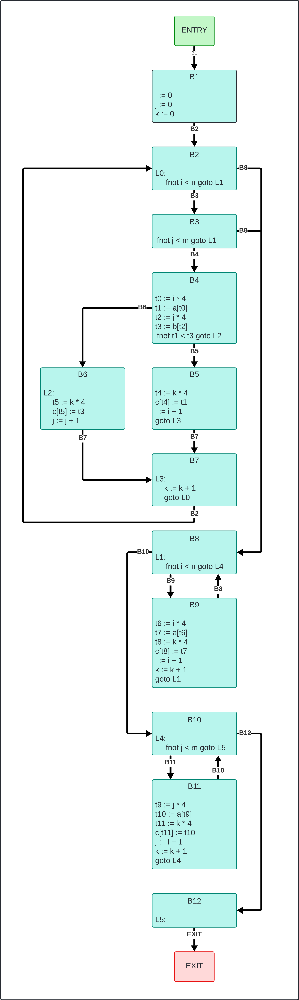
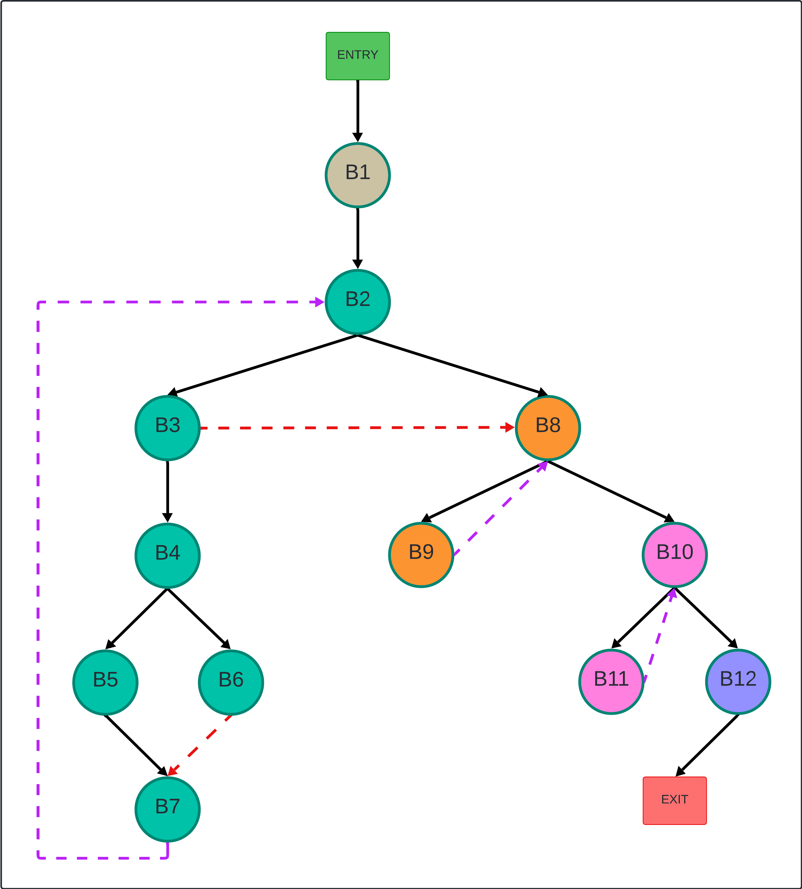
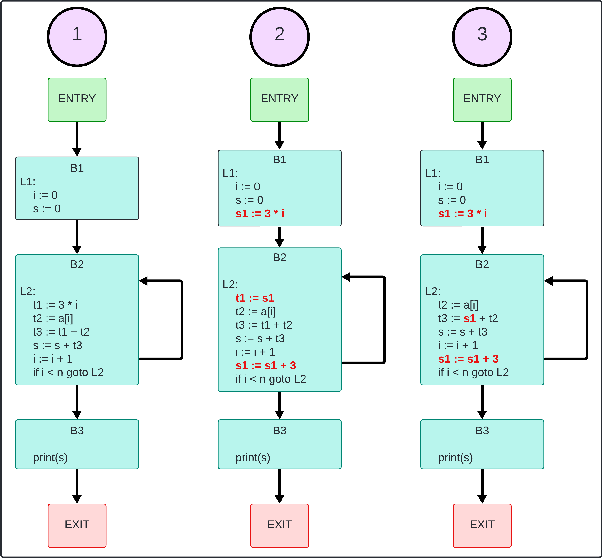

# Resolución de Tarea 2 - Análisis de Flujo y Mejoramiento de Código (Fecha: 27-06-2025)

$$
\begin{matrix}
\text{Universidad Simón Bolívar} \\
\text{Departamento de Computación y Tecnología de la Información} \\
\text{CI4721 - Lenguajes de Programación II} \\
\text{Abril - Julio 2025} \\
\text{Estudiante: Junior Miguel Lara Torres (17-10303)} \\
\text{ } \\
\Large \text{Tarea 2 (15 puntos)} \\
\end{matrix}
$$

>[!IMPORTANT]
> Para una correcta visualización de la tarea es recomendable clonar el repositorio y usar una extensión que admita Markdown + Latex complejo (Ej. [Markdown All in One](https://marketplace.visualstudio.com/items?itemName=yzhang.markdown-all-in-one)), dado que durante la resolución de la tarea se usa latex que el motor Markdown de Github no soporta.

# Indice
- [Resolución de Tarea 2 - Análisis de Flujo y Mejoramiento de Código (Fecha: 27-06-2025)](#resolución-de-tarea-2---análisis-de-flujo-y-mejoramiento-de-código-fecha-27-06-2025)
- [Indice](#indice)
	- [Pregunta 1](#pregunta-1)
		- [Parte (1.a)](#parte-1a)
		- [Parte (1.b)](#parte-1b)
	- [Pregunta 2](#pregunta-2)
		- [Parte (2.a)](#parte-2a)
		- [Parte (2.b)](#parte-2b)
		- [Parte (2.c)](#parte-2c)
	- [Pregunta 3](#pregunta-3)

## Pregunta 1

### Parte (1.a)

La determinación de si una variable en un TAC puede alcanzar el valor cero en cualquier posible camino de ejecución se modela como un **análisis de flujo de datos hacia adelante**.

Se modifica el algoritmo visto en clase de la siguiente manera:
$$
\begin{array}{l}
	OUT[ENTRY] \leftarrow A \\
	\text{for all } B \neq ENTRY \text{ do } \\
	~~~~~~~~OUT[B] \leftarrow \empty \\
	\text{end for } \\
	\text{while } (haya~cambios~en~cualquier~OUT) \text{ do } \\
	~~~~~~~~\text{for all } B \neq ENTRY \text{ do } \\
	~~~~~~~~~~~~~~~~IN[B] \leftarrow \bigcup_{\text{p precedesor de B}} OUT[P] \\
	~~~~~~~~~~~~~~~~update(B, IN[B]) \\
	~~~~~~~~~~~~~~~~OUT[B] \leftarrow CERO_B \cap (IN[B] - NONCERO_B) \\
	~~~~~~~~\text{end for } \\
	\text{end while } \\
\end{array}
$$

>[!IMPORTANT]
> Más adelante se explica la utilidad de `update`.

*   **Estado Inicial:**
    * $OUT[ENTRY] = A$, la salida del bloque de entrada se establece igual a $A$, el conjunto de todas las variables del programa. Esta inicialización se basa en la premisa de que todas las expresiones operan sobre números naturales, lo que implica que cualquier variable es potencialmente cero al inicio, al ser inicializada con un número natural arbitrario.
    * $(\forall B | B \neq ENTRY : OUT[B] = \empty)$, para todos los demás bloques $B$ distintos de $ENTRY$, $OUT[B]$ se inicializa como el conjunto vacío ($\empty$).

*   **Cálculo de `IN`:** Para cada bloque básico $B$, el conjunto $IN[B]$ se calcula como la **unión de los conjuntos $OUT[p]$ de todos los predecesores $p$ de $B$**, en formula $IN[B] = \bigcup OUT[p]$. Esto implica que si una variable posee la posibilidad de ser cero a la salida de al menos uno de los bloques precedentes, entonces conservará dicha posibilidad a la entrada del bloque actual.

*   **Función de Transferencia `f(X)`:** Esta función describe cómo el conjunto de variables potencialmente cero se propaga a través de cada instrucción del TAC.
	*   **Método `update`:** Recibe el bloque básico `B` actual y el conjunto de variables potencialmente cero ($IN[B]$ previamente asignado). 

        >[!IMPORTANT]
		> Cada bloque básico posee dos conjuntos: 
		> * $CERO$: Conjunto de variables potenciables cero después concluir la última instrucción del bloque.
		> * $NONCERO$: Conjunto de variables que son imposible sean cero al concluir la última instrucción del bloque.

		Por lo tanto, este método realiza un análisis interno por `B.code` (código TAC del bloque básico) y según sea el caso se actualizan los conjunto $CERO$ y $NONCERO$ de la siguiente forma:

		*   **Estado inicial:** Inicialmente $IN[B]$ son todas las variables potencialmente cero, por lo tanto, $CERO = IN[B]$;

		Para cada $INSTR \in B.code$ hacer:
        *   **Para $id := ARIT$**: Toda operación aritmética puede resultar en valor 0, por lo que dicho $id$ es potencialmente cero ($CERO.insert(id)$).
        *   **Para $advance~~id$:** Dado que esta isntrucción es equivalente a $id := id + 1$ implica que nunca sera 0 dada la naturaleza del contexto ($NONCERO.insert(id)$) y se debe eliminar del conjunto de variables potencialmente cero ($CERO.erase(id)$).

	*   **Cálculo de `OUT`:** Para cada bloque básico $B$, el conjunto $OUT[B]$ se calcula como la **intersección del cojunto potencialmente cero de $B$ con la diferencia del cojunto union de las variables potencialmente cero de los predecesores de $B$ y el conjunto de variables con imposibilidad de ser cero en $B$**, en formula $OUT[B] \leftarrow CERO_B \cap (IN[B] - NONCERO_B)$.

El algoritmo procede de manera iterativa, actualizando los conjuntos `IN` según la descripción previa y `OUT[B]` mediante la aplicación de la función de transferencia `fB(IN[B])` hasta que no se observen más cambios en ninguno de los conjuntos `OUT[B]`. Este proceso converge debido a la naturaleza monótona del análisis de flujo de datos.

### Parte (1.b)

Para determinar si una expresión de división `id := e1 / e2` presenta un riesgo de estar indefinida debido a un denominador nulo, el procedimiento se centra en el análisis del operando `e2`.

*   **Condición del Operando**: Si `e2` es una variable.
*   **Consulta del Conjunto IN**: Es imperativo **consultar el conjunto `IN`** del bloque básico en el cual se ejecuta la operación de división. Este conjunto `IN` contiene la información acerca de las variables que son **potencialmente cero** a la entrada de dicho bloque.
*   **Conclusión de Riesgo**: Si la variable `e2` se encuentra contenida dentro del conjunto `IN` del bloque básico pertinente, se concluye que la división tiene un **riesgo inherente de resultar indefinida**, dado que `e2` podría adquirir un valor de cero en ese punto de ejecución.

## Pregunta 2

### Parte (2.a)

El Código de Tres Direcciones (TAC) generado a partir del fragmento de código:

```tac
	i := 0
	j := 0
	k := 0
L0:
	ifnot i < n goto L1
	ifnot j < m goto L1
	t0 := i * 4
	t1 := a[t0]
	t2 := j * 4
	t3 := b[t2]
	ifnot t1 < t3 goto L2
	t4 := k * 4
	c[t4] := t1
	i := i + 1
	goto L3
L2:
	t5 := k * 4
	c[t5] := t3
	j := j + 1
L3:
	k := k + 1
	goto L0
L1:
	ifnot i < n goto L4
	t6 := i * 4
	t7 := a[t6]
	t8 := k * 4
	c[t8] := t7
	i := i + 1
	k := k + 1
	goto L1
L4:
	ifnot j < m goto L5
	t9 := j * 4
	t10 := a[t9]
	t11 := k * 4
	c[t11] := t10
	j := l + 1
	k := k + 1
	goto L4
L5:
```

### Parte (2.b)

Los bloques básicos estan compuesto por:

* ENTRY:
 
	Sucesores: B1

* B1:
  	```TAC
		i := 0
		j := 0
		k := 0
	```
	Predecesores: ENTRY

	Sucesores: B2

* B2:
	```TAC
	L0:
		ifnot i < n goto L1
	```
	Predecesores: B1

	Sucesores: B3, B8

* B3:
	```TAC
		ifnot j < m goto L1
	```
	Predecesores: B2

	Sucesores: B4, B8

* B4:
	```TAC
		t0 := i * 4
		t1 := a[t0]
		t2 := j * 4
		t3 := b[t2]
		ifnot t1 < t3 goto L2
	```
	Predecesores: B3

	Sucesores: B5, B6

* B5:
	```TAC
		t4 := k * 4
		c[t4] := t1
		i := i + 1
		goto L3
	```
	Predecesores: B4

	Sucesores: B7

* B6:
	```TAC
	L2:
		t5 := k * 4
		c[t5] := t3
		j := j + 1
	```
	Predecesores: B4

	Sucesores: B7

* B7:
	```TAC
	L3:
		k := k + 1
		goto L0
	```
	Predecesores: B5, B6

	Sucesores: B2
	
* B8:
	```TAC
	L1:
		ifnot i < n goto L4
	```
	Predecesores: B2, B3

	Sucesores: B9, B10
	
* B9:
	```TAC
		t6 := i * 4
		t7 := a[t6]
		t8 := k * 4
		c[t8] := t7
		i := i + 1
		k := k + 1
		goto L1
	```
	Predecesores: B8

	Sucesores: B8
	
* B10:
	```TAC
	L4:
		ifnot j < m goto L5
	```
	Predecesores: B8

	Sucesores: B11, B12
	
* B11:
	```TAC
		t9 := j * 4
		t10 := a[t9]
		t11 := k * 4
		c[t11] := t10
		j := l + 1
		k := k + 1
		goto L4
	```
	Predecesores: B10

	Sucesores: B10
	
* B12:
	```TAC
	L5:
	```
	Predecesores: B10

	Sucesores: EXIT
	
* EXIT:

	Predecesores: B12

Una representacion gráfica del grafo de flujo es:


### Parte (2.c)

Se aplicará el algoritmo para calcular su DFST, obteniendo el siguiente árbol de dominadores:


Aqui se puede apreciar la siguiente información:

*   **Aristas de Avance**: Todas aquellas  aristas de COLOR NEGRO en el grafo.
*   **Aristas de Retroceso**: Todas aquellas aristas de COLOR MORADO en el grafo.
*   **Aristas de Cruce**: Todas aquellas aristas de COLOR ROJO en el grafo.
*   **Aristas de Retorno**: Todas las **Aristas de Retroceso** son aristas de retorno puesto que se cumplen la condiciones:
    * $B2~~dom~~B7$
    * $B8~~dom~~B9$
    * $B10~~dom~~B11$

Dado que todas las aristas de retroceso son aristas de retorno, se tiene que el grafo de
flujo es **reducible**.

Por otro lado, los ciclos naturales estas expresados por grupo de colores en los nodos del grafo.

* Grupo 1 (VERDE AQUA): {B2, B3, B4, B5, B6, B7}
* Grupo 2 (NARANJA): {B8, B9}
* Grupo 3 (ROSADO): {B10, B11}

## Pregunta 3

Para la siguiente imagen se tienen tres estados (1, 2 y 3) del grafo de flujo asociado al codigo TAC proporcionado:



Describe cada estado como sigue:

*   **Estado 1:** 
    *   **Variable Básica:** $i$, con asignación $i := i + 1$
        *   Tupla de $i$: $(i, 1, 0)$
    *   **Variables Indirectas:** $t1$, con asignación $t1 := 3 * i$
        *   Tupla de $t1$: $(i, 3, 0)$

	Una vez identificadas las familias de variables de inducción, se procede a aplicar el **algoritmo de reducción de fuerza** para optimizar las operaciones.

    *   **Introducción de Nueva Variable Temporal:**
		
		Se inserta una nueva variable temporal, $s1$. Esta variable se inicializa en el bloque *pre-header* del ciclo (en este caso, $B1$ actúa como *pre-header* de $B2$) con el valor $3 * i$, que corresponde a la operación que se desea optimizar ($c * i$ donde $c = 3$).

    *   **Reemplazo y Actualización en el Ciclo:**

		Dentro del ciclo, la asignación original $t1 := 3 * i$ se reemplaza por $t1 := s1$.

		Después de la actualización de la variable de inducción básica ($i := i + 1$), se añade una instrucción para actualizar la nueva variable temporal $s1$ de forma aditiva: $s1 := s1 + 3$. Esto evita la costosa multiplicación $3 * i$ en cada iteración del bucle, sustituyéndola por una suma.

	Tras esta transformación, las familias de variables de 	inducción se actualizan, ver **Estado 2**.

*   **Estado 2:**
    *   **Variable Básica:** $i$, Tupla de $i$: $(i, 1, 0)$
    *   **Variables Indirectas:** $t1$, $s1$
        *   Tupla de $t1$: $(i, 3, 0)$
        *   Tupla de $s1$: $(i, 3, 0)$

	Al observar que no hay asignaciones a $s1$ entre la instrucción $t1 := s1$ y su posterior actualización $s1 := s1 + 3$, se concluye que todos los usos de $t1$ pueden ser reemplazados directamente por $s1$. Esto permite eliminar $t1$ del código, simplificando aún más las expresiones.

	Sin embargo, la variable de inducción $i$ no puede ser reemplazada. Esto se debe a que $i$ se utiliza tanto en la condición del bucle ($if i < n goto B2$) como para acceder a los elementos del arreglo a ($t2 := a[i]$). No es posible sustituir $i$ por alguna de sus variables derivadas sin alterar la semántica del programa o introducir errores en el acceso a memoria.

	Finalmente, el código mejorado definitivo refleja estas optimizaciones, sustituyendo la multiplicación por una suma y eliminando la variable temporal $t1$ al fusionarla con $s1$, lo que conlleva una mejora en la eficiencia de ejecución del bucle, ver **Estado 3**.