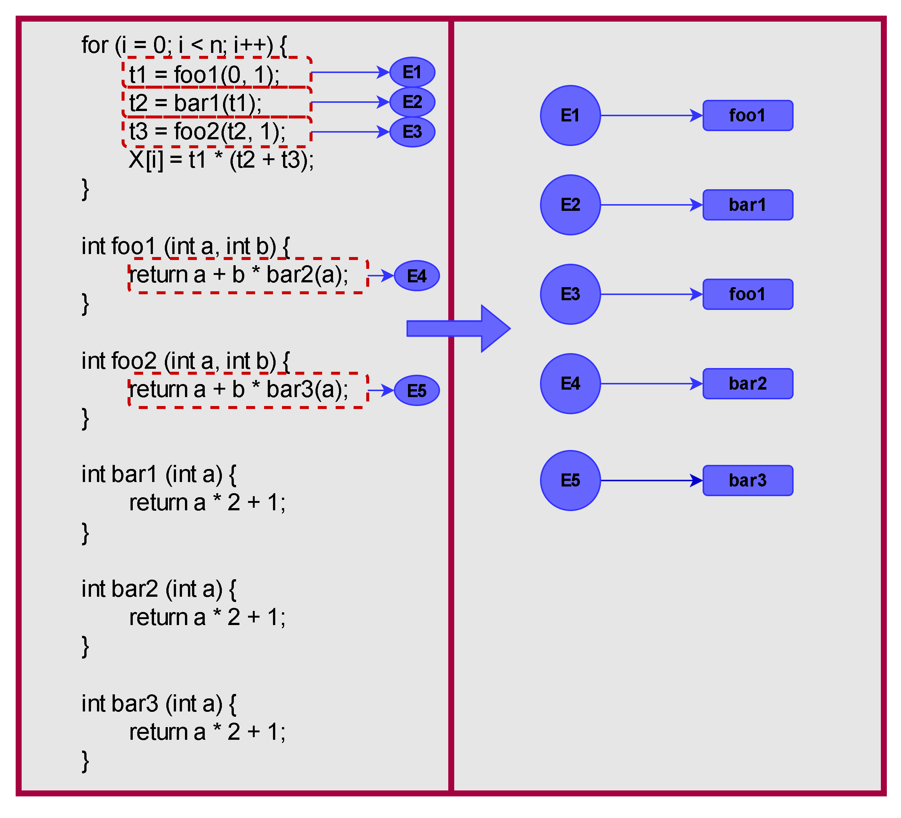

# Resolución de Tarea 3 - Análisis Inter-procedimental y Semántica Formal (Fecha: 16-06-2025)

$$
\begin{matrix}
\text{Universidad Simón Bolívar} \\
\text{Departamento de Computación y Tecnología de la Información} \\
\text{CI4721 - Lenguajes de Programación II} \\
\text{Abril - Julio 2025} \\
\text{Estudiante: Junior Miguel Lara Torres (17-10303)} \\
\text{ } \\
\Large \text{Tarea 3 (15 puntos)} \\
\end{matrix}
$$

>[!IMPORTANT]
> Para una correcta visualización de la tarea es recomendable clonar el repositorio y usar una extensión que admita Markdown + Latex complejo (Ej. [Markdown All in One](https://marketplace.visualstudio.com/items?itemName=yzhang.markdown-all-in-one)), dado que durante la resolución de la tarea se usa latex que el motor Markdown de Github no soporta.

# Indice
- [Resolución de Tarea 3 - Análisis Inter-procedimental y Semántica Formal (Fecha: 16-06-2025)](#resolución-de-tarea-3---análisis-inter-procedimental-y-semántica-formal-fecha-16-06-2025)
- [Indice](#indice)
	- [Pregunta 1](#pregunta-1)
		- [Parte (1.a)](#parte-1a)
		- [Parte (1.b)](#parte-1b)
		- [Parte (1.c)](#parte-1c)
	- [Pregunta 2](#pregunta-2)
	- [Pregunta 3](#pregunta-3)
		- [Parte (3.a)](#parte-3a)
		- [Parte (3.b)](#parte-3b)
		- [Parte (3.c)](#parte-3c)
	- [Pregunta 4](#pregunta-4)

## Pregunta 1

### Parte (1.a)

Se debe tener en cuenta el siguiente etiquetado a nivel grafo


### Parte (1.b)

Ahora se tiene el siguiente programa generado con sus respectivo grafo



### Parte (1.c)

Se tiene que la propagación de constantes es:
  * Para $t1 = foo1(0, 1)$, se tiene que $foo1$ es llamada con $a = 0$, $b = 1$ y retorna la operación $0+1*bar2(0)$
    * Para $bar2(0)$, se tiene que $a = 0$ y retorna el valor de $0*2+1 = 1$
	Por lo tanto, $foo1(0, 1)$ retorna $0+1*bar2(0) = 0+1*1 = 1$ y por consiguiente $t1 = 1$

  * Para $t2 = bar1(t1)$ se tiene que $bar1$ es llamado con $a = t1$, la cual como se vio anteriormente siempre tendrá el valor de $1$
	Por lo tanto, la función retornará $1*2+1 = 3$ y así $t2 = 3$.

  * Para $t3 = foo2(t2, 1)$, se tiene que $foo2$ es llamada con $a = t2$, $b = 1$, para el cual se sabe que el valor de $t2$ siempre será $3$, por lo que retorna la operación $3+1*bar3(3)$.
    * Para $bar3(3)$, se tiene que $a = 3$ y retorna el valor de $3*2+1 = 7$
	Por lo tanto, $foo2(t2, 1)$ retorna $3+1*bar3(3) = 3+1*7 = 10$ y por consiguiente $t3 = 10$
	Dado que $t1, t2, t3$ almacenan siempre valores constantes, se tiene que $t1 * (t2 + t3) = 1 * (3 + 10) = 13$ y, por ende, $X[i] = 13$

Finalmente, el código mejorado resulta en:
	


## Pregunta 2

Para modelar el análisis de "variables potencialmente cero" en Datalog, usaremos predicados IDB para representar el estado de las variables en los puntos del programa. Dada la naturaleza de "may-analysis" (unión como operador de meet) y la necesidad de modelar la propagación secuencial dentro de los bloques, definiremos el estado de las variables en los puntos antes y después de cada instrucción.

  * **Predicados EDB (información del programa, como el TAC y el grafo de flujo)**
	* **program_variable(V)**: V es una variable del programa (ej: program_variable(a)).
    * **block(B)**: B es un bloque básico en el grafo de flujo (ej: block(B1)).
    * **instruction(B, I)**: La instrucción I existe dentro del bloque B (ej: instruction(B1, 1)).
    * **successor_block(B_from, B_to)**: Existe una arista de flujo de control de B_from a B_to (ej: successor_block(B1, B2)).
    * **is_entry_block(B)**: B es el bloque de entrada inicial del programa.
    * **first_instruction_in_block(B, I_first)**: I_first es el índice de la primera instrucción en B.
    * **next_instruction_in_block(B, I_curr, I_next)**: I_next es la instrucción que sigue inmediatamente a I_curr dentro del bloque B.
    * **last_instruction_in_block(B, I_last)**: I_last es el índice de la última instrucción en B.
    * **is_arithmetic_assignment(B, I, V)**: La instrucción I en B es una asignación aritmética a V (ej: V := E1 op E2 o V := op E1).
    * **is_advance_instruction(B, I, V)**: La instrucción I en B es advance V (equivalente a V := V + 1).
    * **is_division_instruction(B, I, Denominator_V)**: La instrucción I en B es una división donde Denominator_V es la variable en el denominador.
  
  * **Predicados IDB (información inferida por el programa Datalog)**
	* **pz_before_instr(B, I, V)**: La variable V es potencialmente cero en el punto del programa inmediatamente antes de la instrucción I en el bloque B.
    * **pz_after_instr(B, I, V)**: La variable V es potencialmente cero en el punto del programa inmediatamente después de la instrucción I en el bloque B.
    * **division_has_zero_risk(B, I)**: La instrucción de división I en el bloque B tiene riesgo de división por cero.

  * **Programa Datalog para Análisis de Variables Potencialmente Cero**
	A continuación, se presentan las reglas Datalog que modelan el análisis, siguiendo la lógica descrita en README.md y adaptándola a la naturaleza declarativa de Datalog. La notación $!$ se usa para negación como falla (o "negation as failure"), que significa "si no se puede inferir".

    * **Estado Inicial (Punto de Entrada del Programa)**
		Al inicio del programa (antes de la primera instrucción del bloque de entrada), todas las variables se consideran potencialmente cero. Esto refleja la condición $OUT[ENTRY] = A$ (donde A es el conjunto de todas las variables) y $IN[ENTRY]$ siendo A. 
		```
		pz_before_instr(B, I_first, V) :-
			is_entry_block(B),
			first_instruction_in_block(B, I_first),
			program_variable(V).
		```
    
	* **Flujo entre Bloques (Operador Meet: Unión)**
		Una variable V es potencialmente cero en la entrada de un bloque `B_to` si fue potencialmente cero a la salida de cualquier bloque predecesor `B_from`. Esto modela $IN[B] = \bigcup OUT[p]$. 
		```
		pz_before_instr(B_to, I_first_to, V) :-
			successor_block(B_from, B_to),
			last_instruction_in_block(B_from, I_last_from),
			pz_after_instr(B_from, I_last_from, V),
			first_instruction_in_block(B_to, I_first_to).
		```
     
	* **Flujo dentro de un Bloque (Modelado de la Función de Transferencia update)**
    	* **Asignación Aritmética (V := ARIT)**
			Si la instrucción I es una asignación aritmética a V, entonces V se vuelve potencialmente cero después de I, independientemente de su estado anterior. Esto modela CERO.insert(id). 
			```
			pz_after_instr(B, I, V) :- 
				is_arithmetic_assignment(B, I, V).
			```
    	* **Propagación del estado "Potencialmente Cero"**
			Una variable V es potencialmente cero después de la instrucción I si fue potencialmente cero antes de I, y si la instrucción I no es una asignación aritmética a V (ya cubierta por la regla anterior) ni una instrucción advance V (que la haría definitivamente no-cero). 
			```
			pz_after_instr(B, I, V) :-
				pz_before_instr(B, I, V),
				!is_arithmetic_assignment(B, I, V),
				!is_advance_instruction(B, I, V).
			```
			Esta regla, al usar la negación, implementa el efecto de `CERO.erase(id)` y `NONCERO.insert(id)` al evitar que se infiera `pz_after_instr` si la variable V es "matada" por una instrucción advance en el punto (B, I).
    	* **Propagación secuencial a la siguiente instrucción dentro del mismo bloque**
			Una variable V es potencialmente cero antes de la instrucción `I_next` si fue potencialmente cero después de la instrucción `I_curr` y `I_next` es la siguiente instrucción en el bloque. 
		    ```
			pz_before_instr(B, I_next, V) :-
		   		next_instruction_in_block(B, I_curr, I_next),
		   		<center> pz_after_instr(B, I_curr, V)
			```

  * **Programa Datalog para Análisis de Riesgo de División por Cero**
	
	Este conjunto de reglas utiliza los hechos inferidos sobre pz_before_instr para determinar las divisiones con riesgo.
	```
	division_has_zero_risk(B, I) :-
		is_division_instruction(B, I, Denominator_V),
		pz_before_instr(B, I, Denominator_V)
	```
	
	Rationale: Si una instrucción I en el bloque B es una división cuyo denominador es la variable Denominator_V, y esta variable es potencialmente cero justo antes de que se ejecute la instrucción I, entonces existe un riesgo de división por cero.

## Pregunta 3

### Parte (3.a)

### Parte (3.b)

### Parte (3.c)

## Pregunta 4

